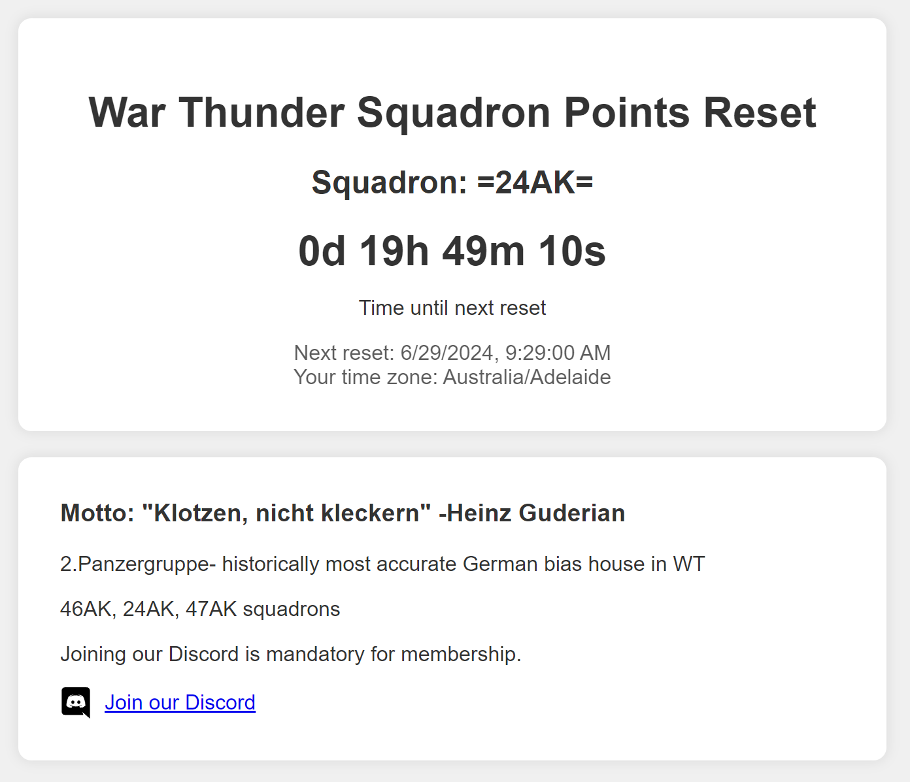

# 24AK Squadron Points Countdown

Welcome to the 24AK Squadron Points Countdown project! This project is a web-based countdown timer for the next War Thunder squadron points reset, specifically for the =24AK= squadron.

## Table of Contents

- [About](#about)
- [Features](#features)
- [Usage](#usage)
- [Installation](#installation)
- [Contributing](#contributing)
- [License](#license)

## About

This website provides a countdown timer for the next War Thunder squadron points reset. It automatically adjusts for your local time zone and provides options to switch between light and dark themes. The website also includes additional information about the =24AK= squadron and a link to join their Discord server.

Visit the live site: [24AK Squadron Points Countdown](https://cat768.github.io/24ak-squadron-countdown/)

## Features

- Countdown timer to the next War Thunder squadron points reset
- Automatic time zone adjustment
- Light and dark theme modes
- Information about the =24AK= squadron
- Link to join the squadron's Discord server

## Usage

1. Visit the [live site](https://cat768.github.io/24ak-squadron-countdown/).
2. View the countdown timer for the next squadron points reset.
3. Switch between light and dark modes using the theme selector at the top right corner.
4. Read about the squadron and join their Discord server using the provided link.

## Installation

If you want to run this project locally:

1. Clone the repository:

    \`\`\`bash
    git clone https://github.com/Cat768/24ak-squadron-countdown.git
    \`\`\`

2. Navigate to the project directory:

    \`\`\`bash
    cd 24ak-squadron-countdown
    \`\`\`

3. Open the \`index.html\` file in your preferred web browser:

    \`\`\`bash
    open index.html
    \`\`\`

## Contributing

Contributions are welcome! If you have any suggestions or improvements, feel free to create an issue or submit a pull request.

1. Fork the repository.
2. Create a new branch:

    \`\`\`bash
    git checkout -b feature-branch
    \`\`\`

3. Make your changes and commit them:

    \`\`\`bash
    git commit -m "Add new feature"
    \`\`\`

4. Push to the branch:

    \`\`\`bash
    git push origin feature-branch
    \`\`\`

5. Open a pull request on GitHub.

## License

This project is licensed under the MIT License. See the [LICENSE](LICENSE) file for more details.
